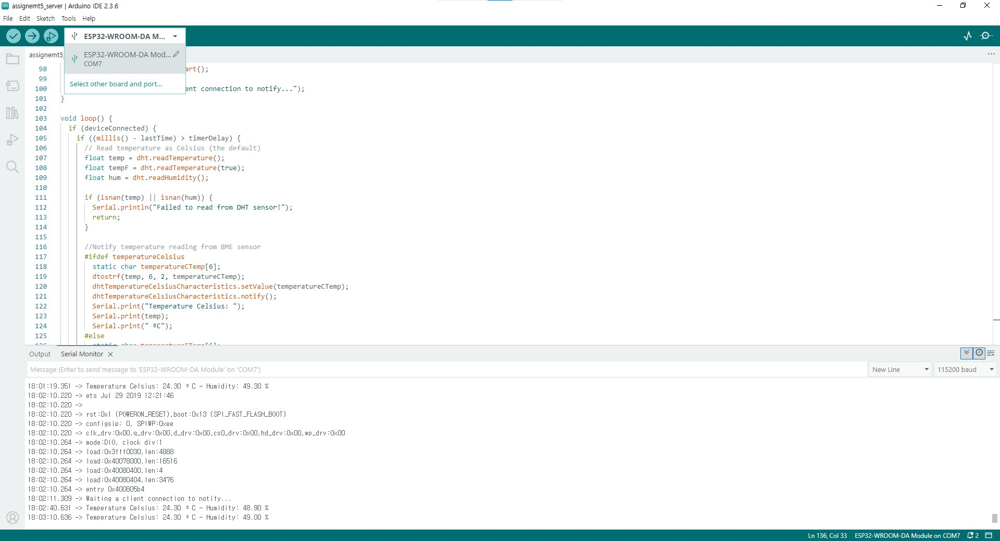
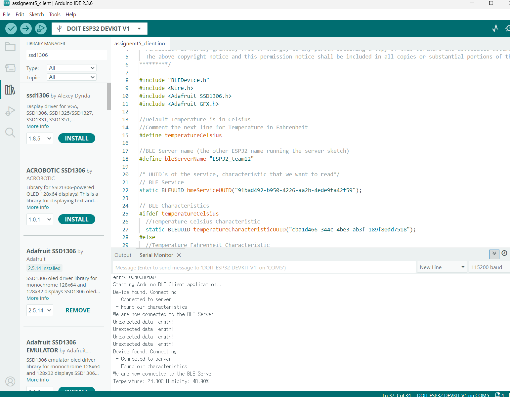
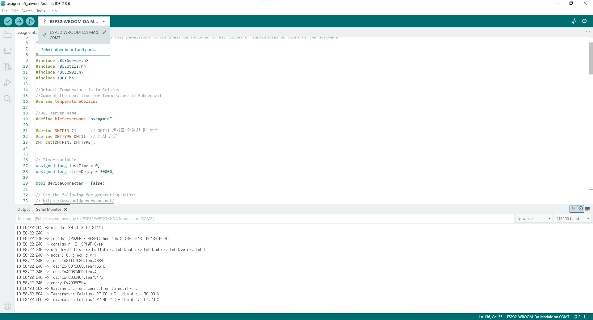
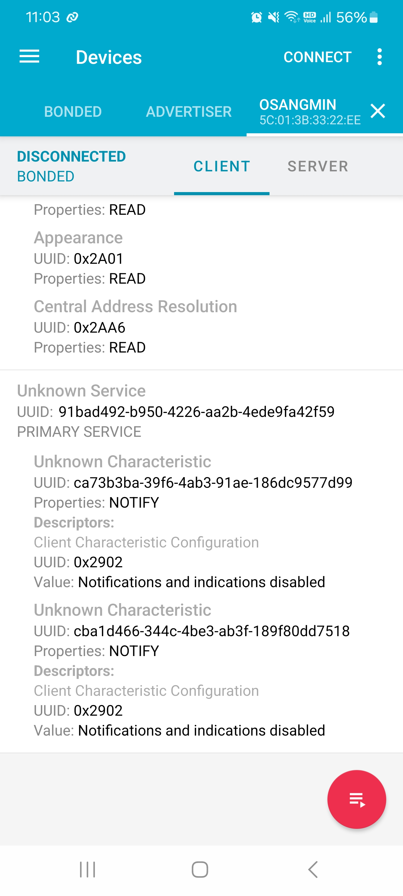
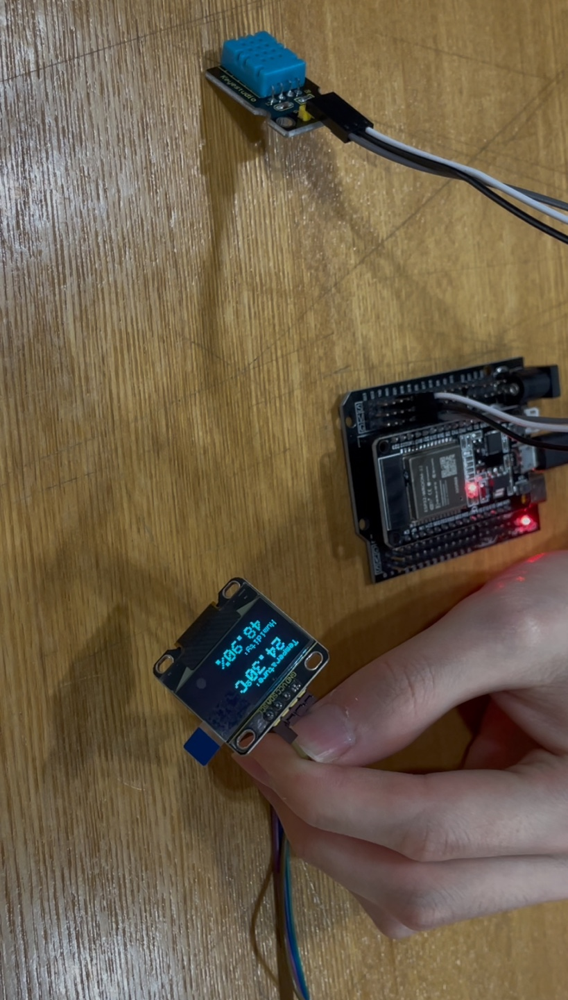

# IoT25-HW05-ESP32-BLE-Server-and-Client

## Screenshots of working project
### Task 1



### Task 2



## Excuting photo and video
### Task 1

### Task 2


## Source code
### Sever code
```cpp
/*********
  Rui Santos
  Complete instructions at https://RandomNerdTutorials.com/esp32-ble-server-client/
  Permission is hereby granted, free of charge, to any person obtaining a copy of this software and associated documentation files.
  The above copyright notice and this permission notice shall be included in all copies or substantial portions of the Software.
*********/

#include <BLEDevice.h>
#include <BLEServer.h>
#include <BLEUtils.h>
#include <BLE2902.h>
#include <DHT.h>

//Default Temperature is in Celsius
//Comment the next line for Temperature in Fahrenheit
#define temperatureCelsius

//BLE server name
#define bleServerName "ESP32_team12"

#define DHTPIN 21      // DHT11 센서를 연결한 핀 번호
#define DHTTYPE DHT11  // 센서 종류
DHT dht(DHTPIN, DHTTYPE);


// Timer variables
unsigned long lastTime = 0;
unsigned long timerDelay = 30000;

bool deviceConnected = false;

// See the following for generating UUIDs:
// https://www.uuidgenerator.net/
#define SERVICE_UUID "91bad492-b950-4226-aa2b-4ede9fa42f59"

// Temperature Characteristic and Descriptor
#ifdef temperatureCelsius
  BLECharacteristic dhtTemperatureCelsiusCharacteristics("cba1d466-344c-4be3-ab3f-189f80dd7518", BLECharacteristic::PROPERTY_NOTIFY);
  BLEDescriptor dhtTemperatureCelsiusDescriptor(BLEUUID((uint16_t)0x2902));
#else
  BLECharacteristic dhtTemperatureFahrenheitCharacteristics("f78ebbff-c8b7-4107-93de-889a6a06d408", BLECharacteristic::PROPERTY_NOTIFY);
  BLEDescriptor dhtTemperatureFahrenheitDescriptor(BLEUUID((uint16_t)0x2902));
#endif

// Humidity Characteristic and Descriptor
BLECharacteristic dhtHumidityCharacteristics("ca73b3ba-39f6-4ab3-91ae-186dc9577d99", BLECharacteristic::PROPERTY_NOTIFY);
BLEDescriptor dhtHumidityDescriptor(BLEUUID((uint16_t)0x2903));

//Setup callbacks onConnect and onDisconnect
class MyServerCallbacks: public BLEServerCallbacks {
  void onConnect(BLEServer* pServer) {
    deviceConnected = true;
  };
  void onDisconnect(BLEServer* pServer) {
    deviceConnected = false;
  }
};


void setup() {
  // Start serial communication 
  Serial.begin(115200);

  // Init BME Sensor
  dht.begin();

  // Create the BLE Device
  BLEDevice::init(bleServerName);

  // Create the BLE Server
  BLEServer *pServer = BLEDevice::createServer();
  pServer->setCallbacks(new MyServerCallbacks());

  // Create the BLE Service
  BLEService *dhtService = pServer->createService(SERVICE_UUID);

  // Create BLE Characteristics and Create a BLE Descriptor
  // Temperature
  #ifdef temperatureCelsius
    dhtService->addCharacteristic(&dhtTemperatureCelsiusCharacteristics);
    dhtTemperatureCelsiusDescriptor.setValue("DHT11 temperature Celsius");
    dhtTemperatureCelsiusCharacteristics.addDescriptor(&dhtTemperatureCelsiusDescriptor);
  #else
    dhtService->addCharacteristic(&dhtTemperatureFahrenheitCharacteristics);
    dhtTemperatureFahrenheitDescriptor.setValue("DHT11 temperature Fahrenheit");
    dhtTemperatureFahrenheitCharacteristics.addDescriptor(&dhtTemperatureFahrenheitDescriptor);
  #endif 

  // Humidity
  dhtService->addCharacteristic(&dhtHumidityCharacteristics);
  dhtHumidityDescriptor.setValue("DHT11 humidity");
  dhtHumidityCharacteristics.addDescriptor(new BLE2902());

  dhtService->start();

  BLEAdvertising *pAdvertising = BLEDevice::getAdvertising();
  pAdvertising->addServiceUUID(SERVICE_UUID);
  pServer->getAdvertising()->start();

  Serial.println("Waiting a client connection to notify...");
}

void loop() {
  if (deviceConnected) {
    if ((millis() - lastTime) > timerDelay) {
      // Read temperature as Celsius (the default)
      float temp = dht.readTemperature();
      float tempF = dht.readTemperature(true);
      float hum = dht.readHumidity();
  
      if (isnan(temp) || isnan(hum)) {
        Serial.println("Failed to read from DHT sensor!");
        return;
      }

      //Notify temperature reading from BME sensor
      #ifdef temperatureCelsius
        static char temperatureCTemp[6];
        dtostrf(temp, 6, 2, temperatureCTemp);
        dhtTemperatureCelsiusCharacteristics.setValue(temperatureCTemp);
        dhtTemperatureCelsiusCharacteristics.notify();
        Serial.print("Temperature Celsius: ");
        Serial.print(temp);
        Serial.print(" ºC");
      #else
        static char temperatureFTemp[6];
        dtostrf(tempF, 6, 2, temperatureFTemp);
        dhtTemperatureFahrenheitCharacteristics.setValue(temperatureFTemp);
        dhtTemperatureFahrenheitCharacteristics.notify();
        Serial.print("Temperature Fahrenheit: ");
        Serial.print(tempF);
        Serial.print(" ºF");
      #endif
      
      //Notify humidity reading from BME
      static char humidityTemp[6];
      dtostrf(hum, 6, 2, humidityTemp);
      dhtHumidityCharacteristics.setValue(humidityTemp);
      dhtHumidityCharacteristics.notify();

      Serial.print(" - Humidity: ");
      Serial.print(hum);
      Serial.println(" %");

      lastTime = millis();
    }
  }
}
```

### Client cdoe
```cpp
/*********
  Rui Santos
  Complete instructions at https://RandomNerdTutorials.com/esp32-ble-server-client/
  Permission is hereby granted, free of charge, to any person obtaining a copy of this software and associated documentation files.
  The above copyright notice and this permission notice shall be included in all copies or substantial portions of the Software.
*********/

#include "BLEDevice.h"
#include <Wire.h>
#include <Adafruit_SSD1306.h>
#include <Adafruit_GFX.h>

//Default Temperature is in Celsius
//Comment the next line for Temperature in Fahrenheit
#define temperatureCelsius

//BLE Server name (the other ESP32 name running the server sketch)
#define bleServerName "ESP32_osangmin"

/* UUID's of the service, characteristic that we want to read*/
// BLE Service
static BLEUUID bmeServiceUUID("91bad492-b950-4226-aa2b-4ede9fa42f59");

// BLE Characteristics
#ifdef temperatureCelsius
  //Temperature Celsius Characteristic
  static BLEUUID temperatureCharacteristicUUID("cba1d466-344c-4be3-ab3f-189f80dd7518");
#else
  //Temperature Fahrenheit Characteristic
  static BLEUUID temperatureCharacteristicUUID("f78ebbff-c8b7-4107-93de-889a6a06d408");
#endif

// Humidity Characteristic
static BLEUUID humidityCharacteristicUUID("ca73b3ba-39f6-4ab3-91ae-186dc9577d99");

//Flags stating if should begin connecting and if the connection is up
static boolean doConnect = false;
static boolean connected = false;

//Address of the peripheral device. Address will be found during scanning...
static BLEAddress *pServerAddress;
 
//Characteristicd that we want to read
static BLERemoteCharacteristic* temperatureCharacteristic;
static BLERemoteCharacteristic* humidityCharacteristic;

//Activate notify
const uint8_t notificationOn[] = {0x1, 0x0};
const uint8_t notificationOff[] = {0x0, 0x0};

#define SCREEN_WIDTH 128 // OLED display width, in pixels
#define SCREEN_HEIGHT 64 // OLED display height, in pixels

//Declaration for an SSD1306 display connected to I2C (SDA, SCL pins)
Adafruit_SSD1306 display(SCREEN_WIDTH, SCREEN_HEIGHT, &Wire, -1);

//Variables to store temperature and humidity
char temperatureChar[10] = {0};  // Add space for null terminator
char humidityChar[10] = {0};

//Flags to check whether new temperature and humidity readings are available
boolean newTemperature = false;
boolean newHumidity = false;

//Connect to the BLE Server that has the name, Service, and Characteristics
bool connectToServer(BLEAddress pAddress) {
   BLEClient* pClient = BLEDevice::createClient();
 
  // Connect to the remove BLE Server.
  pClient->connect(pAddress);
  Serial.println(" - Connected to server");
 
  // Obtain a reference to the service we are after in the remote BLE server.
  BLERemoteService* pRemoteService = pClient->getService(bmeServiceUUID);
  if (pRemoteService == nullptr) {
    Serial.print("Failed to find our service UUID: ");
    Serial.println(bmeServiceUUID.toString().c_str());
    return (false);
  }
 
  // Obtain a reference to the characteristics in the service of the remote BLE server.
  temperatureCharacteristic = pRemoteService->getCharacteristic(temperatureCharacteristicUUID);
  humidityCharacteristic = pRemoteService->getCharacteristic(humidityCharacteristicUUID);

  if (temperatureCharacteristic == nullptr || humidityCharacteristic == nullptr) {
    Serial.print("Failed to find our characteristic UUID");
    return false;
  }
  Serial.println(" - Found our characteristics");
 
  //Assign callback functions for the Characteristics
  temperatureCharacteristic->registerForNotify(temperatureNotifyCallback);
  humidityCharacteristic->registerForNotify(humidityNotifyCallback);
  return true;
}

//Callback function that gets called, when another device's advertisement has been received
class MyAdvertisedDeviceCallbacks: public BLEAdvertisedDeviceCallbacks {
  void onResult(BLEAdvertisedDevice advertisedDevice) {
    if (advertisedDevice.getName() == bleServerName) { //Check if the name of the advertiser matches
      advertisedDevice.getScan()->stop(); //Scan can be stopped, we found what we are looking for
      pServerAddress = new BLEAddress(advertisedDevice.getAddress()); //Address of advertiser is the one we need
      doConnect = true; //Set indicator, stating that we are ready to connect
      Serial.println("Device found. Connecting!");
    }
  }
};
 
// Temperature callback
static void temperatureNotifyCallback(BLERemoteCharacteristic* pBLERemoteCharacteristic, 
                                      uint8_t* pData, size_t length, bool isNotify) {
  memset(temperatureChar, 0, sizeof(temperatureChar));  // clear buffer
  strncpy(temperatureChar, (char*)pData, min(length, sizeof(temperatureChar) - 1));
  newTemperature = true;
}

// Humidity callback
static void humidityNotifyCallback(BLERemoteCharacteristic* pBLERemoteCharacteristic, 
                                   uint8_t* pData, size_t length, bool isNotify) {
  memset(humidityChar, 0, sizeof(humidityChar));  // clear buffer
  strncpy(humidityChar, (char*)pData, min(length, sizeof(humidityChar) - 1));
  newHumidity = true;
}

//function that prints the latest sensor readings in the OLED display
void printReadings(){
  
  display.clearDisplay();  
  // display temperature
  display.setTextSize(1);
  display.setCursor(0,0);
  display.print("Temperature: ");
  display.setTextSize(2);
  display.setCursor(0,10);
  display.print(temperatureChar);
  display.setTextSize(1);
  display.cp437(true);
  display.write(167);
  display.setTextSize(2);
  Serial.print("Temperature:");
  Serial.print(temperatureChar);
  #ifdef temperatureCelsius
    //Temperature Celsius
    display.print("C");
    Serial.print("C");
  #else
    //Temperature Fahrenheit
    display.print("F");
    Serial.print("F");
  #endif

  //display humidity 
  display.setTextSize(1);
  display.setCursor(0, 35);
  display.print("Humidity: ");
  display.setTextSize(2);
  display.setCursor(0, 45);
  display.print(humidityChar);
  display.print("%");
  display.display();
  Serial.print(" Humidity:");
  Serial.print(humidityChar); 
  Serial.println("%");
}

void setup() {
  //OLED display setup
  // SSD1306_SWITCHCAPVCC = generate display voltage from 3.3V internally
  if(!display.begin(SSD1306_SWITCHCAPVCC, 0x3C)) { // Address 0x3C for 128x32
    Serial.println(F("SSD1306 allocation failed"));
    for(;;); // Don't proceed, loop forever
  }
  display.clearDisplay();
  display.setTextSize(2);
  display.setTextColor(WHITE,0);
  display.setCursor(0,25);
  display.print("BLE Client");
  display.display();
  
  //Start serial communication
  Serial.begin(115200);
  Serial.println("Starting Arduino BLE Client application...");

  //Init BLE device
  BLEDevice::init("");
 
  // Retrieve a Scanner and set the callback we want to use to be informed when we
  // have detected a new device.  Specify that we want active scanning and start the
  // scan to run for 30 seconds.
  BLEScan* pBLEScan = BLEDevice::getScan();
  pBLEScan->setAdvertisedDeviceCallbacks(new MyAdvertisedDeviceCallbacks());
  pBLEScan->setActiveScan(true);
  pBLEScan->start(30);
}

void loop() {
  // If the flag "doConnect" is true then we have scanned for and found the desired
  // BLE Server with which we wish to connect.  Now we connect to it.  Once we are
  // connected we set the connected flag to be true.
  if (doConnect == true) {
    if (connectToServer(*pServerAddress)) {
      Serial.println("We are now connected to the BLE Server.");
      //Activate the Notify property of each Characteristic
      temperatureCharacteristic->getDescriptor(BLEUUID((uint16_t)0x2902))->writeValue((uint8_t*)notificationOn, 2, true);
      humidityCharacteristic->getDescriptor(BLEUUID((uint16_t)0x2902))->writeValue((uint8_t*)notificationOn, 2, true);
      connected = true;
    } else {
      Serial.println("We have failed to connect to the server; Restart your device to scan for nearby BLE server again.");
    }
    doConnect = false;
  }
  //if new temperature readings are available, print in the OLED
  if (newTemperature && newHumidity){
    newTemperature = false;
    newHumidity = false;
    printReadings();
  }
  delay(1000); // Delay a second between loops.
}
```
